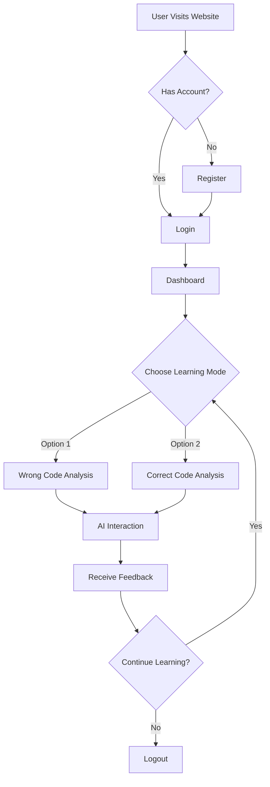

# 🤖 Autonomous Tutor

An AI-powered learning platform designed to help beginner and intermediate programmers improve their coding and analysis skills.

## 🌟 Features

- 🐛 **Wrong Code Analysis**: Learn to identify and fix errors in code snippets with AI-guided assistance
- ✅ **Correct Code Analysis**: Understand why code works correctly and learn best practices
- 🌐 **Multi-language Support**: Currently supports Python, Java, C#, and C++
- 🔄 **Interactive Learning**: Real-time AI feedback and code explanations
- 🌍 **Internationalization**: Supports English and Turkish interfaces
- 🎨 **Modern UI**: Cyberpunk-themed interface with responsive design

## 🔧 Technology Stack

- **Frontend**: HTML5, CSS3, JavaScript
- **Backend**: Node.js, Express.js
- **AI Integration**: Google Gemini API
- **Authentication**: bcryptjs
- **Database**: Local JSON file storage
- **API Communication**: Axios
- **Styling**: Bootstrap 4.5.2, Font Awesome 6

## 📋 Prerequisites

Before you begin, ensure you have the following installed:

- Node.js (v14.0.0 or higher)
- npm (v6.0.0 or higher)

## 🚀 Installation

1. Clone the repository:

```bash
git clone https://github.com/tamerakdeniz/Decentralized-Tutor.git
cd Decentralized-Tutor/app
```

2. Install dependencies:

```bash
npm install
```

3. Create a `.env` file in the root directory and add your Gemini API key:

```env
GEMINI_API_KEY=your_api_key_here
```

4. Start the application:

```bash
npm start
```

5. Open your browser and navigate to:

```
http://localhost:3000
```

## 📁 Project Structure

```
app/
├── frontend/
│   ├── css/
│   │   └── style.css
│   ├── js/
│   │   ├── app.js
│   │   ├── chat.js
│   │   ├── dashboard.js
│   │   ├── login.js
│   │   ├── particles.js
│   │   ├── register.js
│   │   └── translations.js
│   ├── img/
│   │   ├── favicon.ico
│   │   └── favicon.png
│   ├── chat.html
│   ├── dashboard.html
│   ├── index.html
│   ├── login.html
│   └── register.html
├── db.json
├── package.json
└── server.js
```

## 🔄 Application Workflow



### Operational Process:

1. **User Registration/Login**:

   - New users create an account with username and password
   - Existing users log in with credentials
   - Passwords are securely hashed using bcryptjs

2. **Dashboard**:

   - Users see their learning statistics
   - Choose preferred programming language
   - Select learning mode
   - View recent activity

3. **Learning Modes**:

   - **Wrong Code Analysis**:

     - AI provides code snippets with intentional bugs
     - Users identify and explain issues
     - AI provides feedback and corrections

   - **Correct Code Analysis**:
     - AI shows properly written code
     - Users learn best practices
     - AI explains why the code is well-structured

4. **AI Interaction**:

   - Real-time communication with Gemini AI
   - Context-aware responses
   - Code highlighting and explanation
   - Copy-paste functionality for code snippets

5. **Progress Tracking**:
   - Session counting
   - Problem-solving history
   - Activity logging

## 🔐 Security Features

- Password hashing using bcryptjs
- CORS protection
- Input validation
- Secure session management

## 🌐 API Endpoints

- `POST /api/register`: User registration
- `POST /api/login`: User authentication
- `POST /api/chat`: AI interaction endpoint

## 💡 Environment Variables

Required environment variables:

```env
PORT=3000 (default)
GEMINI_API_KEY=your_api_key_here
```

## 🤝 Contributing

1. Fork the repository
2. Create your feature branch (`git checkout -b feature/AmazingFeature`)
3. Commit your changes (`git commit -m 'Add some AmazingFeature'`)
4. Push to the branch (`git push origin feature/AmazingFeature`)
5. Open a Pull Request

## 📝 License

This project is licensed under the MIT License - see the LICENSE file for details.

## 🙏 Acknowledgments

- Google Gemini API for AI capabilities
- Bootstrap for responsive design
- Font Awesome for icons
- Particles.js for background animations
